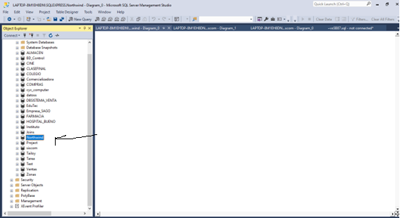
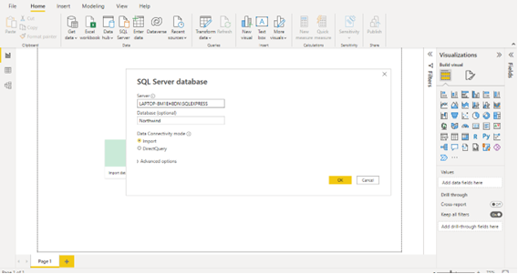
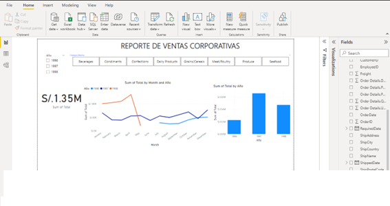
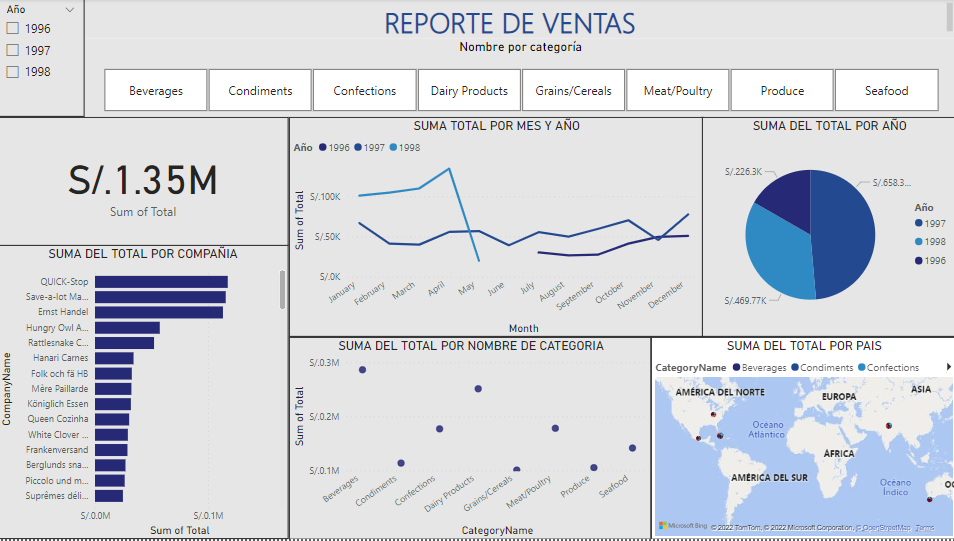

# Reporte de ventas en PowerBI desde una base de datos SQL Server

Hola y bienvenidos :wave:, en esta ocasión vamos crear un dashboard interactivo recpecto a las ventas en Power BI apartir de la información que nos brinda la base de datos northwind en el gestor Sql Server.
Para ello recordaremos conceptos como ETL(extracción,transformación y carga), modelado estrella,cardinalidad, fórmulas Dax, flujo de datos, etc. 
Listo, entonces vamos.

- En primer lugar identificaremos nuestra fuente de datos para poder realizar el reporte de ventas. En está ocasion la fuente de datos será la base de datos 
northwind desde SQL Server.
 
  

- Una vez identificada nuestra fuente de información, procedemos ir a powerBI para hacer la importación de los datos. 
Dentro del proceso de ETL, esta parte es conocida como la de extraccion. 

  

- Una vez importada nuestra de datos a PowerBI,visualizamos una gran cantidad de tablas pero para esta ocasion como queremos tener informacion relacionada al reporte de ventas. procedemos a seleccionar 5 tablas de nuestra base de datos northwind y le damos en el boton de transformar datos.

  

- Ahora toca asegurarnos que la imformación de los campos en nuestras tablas sean las que necesitamos y que esten bajo el formato correcto, para esto se hacen los cambios necesarios para tener datos coherentes y que permitan relacionarce entre si. Ha este proceso se le conoce como transformacion, dentro del ETL.

  

- Una vez hechos los ajustes necesarios en la información, procedemos a cargar la información(Load) y damos click en la ventana de modelo para visualizar las relaciones entre las tablas y hacer ajustes de ser necesario. Se recomienda, en lomayor posible trabajar con el modelo estrella para el modelado de informacion pues es un modelo que facilita la manipulacion de la informacion.

  

- Para este caso, vemos necesario hacer una tabla de fecha y agregarla al modelado.Esta dimension es vital para porder organizar la informacion en base a la fecha, también se agregan nuevas columnas incluyendo fechas mas especificas.
 
  

- Ahora toca la creación la dashboard para lo cual necesitaremos incluir una columna que mediante el uso de formulas DAX nos muestre el resultado de la cantidad * el precio unitario de los productos.

  

- Vamos incluyendo en nuestro reporte visual informacion asociada a las ventas totales, ventas por mes, ventas por año.
También podemos observar que la parte superior filtros asociados a las categorias y los años que nos permitira segmentar nuestra información y mostarla de forma dinámica y especifica. 

  

- Agregamos información de ventas totales por compañia y por país segmentado por categoría mediante un mapa interactivo.
Para finalizar agregamos unos ajustes estéticos a nuestro reporte(colores,tipo de letra, alineciones,etc) y listo!
Nuesto reporte ha sido completado y listo para ofrecer información relevante.

 *  Gracias por llegar hasta aquí, si deseas ver otro ejemplo [click aquí](https://github.com/alexgarciaa/Caso-PowerBI-1/blob/main/hello.md)
 
